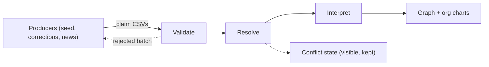

# Ingest — the producer boundary and the claim pipeline

How outside facts become graph structure. This is the only way data enters the map.

---

## Claims versus interpretation

What producers send are **claims**: sourced, timed assertions.

A typical affiliation claim says that this person, at this organization, under this raw title, with this participation type, over this interval, according to this source. Optionally it carries a reporting assertion or a department string as an observed claim.

What this product **derives** afterward is `function`, `seniority`, and structural projections such as department grouping and depth to apex.

Derived fields are not claims. They are recomputable interpretations, and a producer must never write them as the system of record ([ADR-0002](../decisions/0002-claims-before-interpretation.md)).

If a producer does send a normalized hint, it is treated as a hint with provenance — evidence to weigh, not truth to accept.

---

## The producer boundary

Collection lives outside this repository ([ADR-0003](../decisions/0003-collection-outside-this-repo.md)). No scrapers, crawlers, research desks, or editorial tooling here.

The boundary is a batch CSV claim contract, specified in [../contracts/claim-schema.md](../contracts/claim-schema.md).

The first producer is a seeding project supplying team-side depth. Later producers use the same contract — a corrections batch, or a press-release extractor that finds someone accepting a new job. There is no privileged side channel into the graph.

**Users are producers too.** A viewer correcting an org chart, or a person claiming themselves and supplying their own history, emits ordinary claims with their own source types. This is a product surface rather than collection, so it does not conflict with [ADR-0003](../decisions/0003-collection-outside-this-repo.md), and self-assertion carries high weight for identity without automatically carrying it for title ([ADR-0010](../decisions/0010-person-identity-without-pii.md)). What a user account may bind to is still open ([ADR-0011](../decisions/0011-account-to-person-binding.md)).

---

## Pipeline

### 1. Validate

Structural correctness of the batch, before anything touches the graph.

- Required fields present, types well formed, intervals coherent
- Referential integrity within the batch
- Mandatory `type` on every affiliation and relationship claim
- **No PII.** Contact columns are rejected, not ignored, so a well-meaning producer cannot quietly widen the surface ([ADR-0004](../decisions/0004-no-pii.md))
- Provenance present on every claim

A batch that fails validation is rejected as a unit with an actionable report. Partial silent acceptance is worse than a failed import.

### 2. Resolve

Reconcile the claim against what is already known. This is where identity and history live.

**Identity.** A Person is a derived cluster over immutable claims, keyed by an internal UID that we assign. Producer references and public profile URLs are weighted evidence, never authority. Clustering is probabilistic — over name forms, organization, interval adjacency, affiliation sequence, profile URL, corroboration, and source-type weight — and confidence bands are per-surface, since a wrong grouping on a chart costs less than a wrong warm path to a named human. Because clustering is a projection, a merge is non-destructive and a better matcher re-derives identity retroactively. Full rules in [ADR-0010](../decisions/0010-person-identity-without-pii.md).

Clustering reads **claims**, never resolved affiliations, which keeps the derivation one-directional: claims feed identity, identity feeds resolved structure. A person's employment history is therefore the cluster's own claim set — the fingerprint exists by construction, with nothing to denormalize.

Identity judgments from human validators and research agents arrive as `same_as` and `not_same_as` claims, and act as anchors that re-clustering must respect. Person UIDs persist across re-runs, with redirects for retired UIDs ([ADR-0012](../decisions/0012-identity-survives-reclustering.md)).

Outcomes for an affiliation claim:

- **Corroborate** — the same participation, now with a second source; confidence rises
- **Refine** — same participation, better detail, such as a title change within one interval
- **Supersede or close** — a later claim ends or splits an earlier interval
- **Conflict** — claims disagree and neither wins; the conflict is recorded and visible

Conflict is a first-class state, not an error. Provenance, recency, and corroboration decide, never authorial order. History is never discarded ([ADR-0002](../decisions/0002-claims-before-interpretation.md)).

### 3. Interpret

The ontology runs on the resolved affiliation: `function` and `seniority`, with confidence and traceability, stamped with an ontology version. Rules are in [ontology-title.md](ontology-title.md).

Interpretation is recomputable. Improving the ontology re-derives structure without touching a single claim.

---

## Worked example: a hire in a press release

A producer extracts that someone has accepted a new role at an organization.

1. **Validate** — person reference, organization reference, raw title, `type`, as-of date, source URL. No contact data.
2. **Resolve** — match the person against known people. The claim implies a new affiliation at the new organization, and usually the close or split of a prior affiliation elsewhere. If the prior affiliation still shows as current from a stale directory scrape, that is a conflict resolved by recency and source strength, keeping both claims.
3. **Interpret** — classify the new raw title into function and seniority.

The extractor never writes "Partnerships, VP-band" into the graph. It reports what the press release said, and the map decides what that means.

---

## Invariants

- Raw claims are immutable and permanent. Corrections are new claims.
- Every graph fact traces to at least one claim with a source.
- Re-importing the same batch is idempotent.
- Derived fields carry an ontology version so old structure stays interpretable.
- Person identity is derived, versioned, and re-derivable — never destructively merged.
- Person UIDs survive re-clustering; retired UIDs redirect rather than disappear.
- The derived zone can be dropped and rebuilt from claims alone ([ADR-0009](../decisions/0009-stack-and-datastore.md)).
- Nothing enters the graph except through this pipeline.

Storage shapes are sketched in [data-model.md](data-model.md), which is non-binding.
