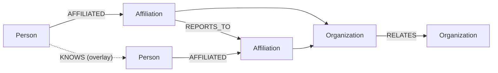

# Core ontology — objects, edges, and types

The primary objects and edges of the industry graph. Storage, APIs, and algorithms are not prescribed here; the datastore is still open ([ADR-0009](../decisions/0009-stack-and-datastore.md)).

Companion documents: [ontology-title.md](ontology-title.md) for how titles become comparable structure, [ingest.md](ingest.md) for how claims become graph facts.

---

## Objects

| Object | Meaning |
| --- | --- |
| **Person** | Durable human identity |
| **Organization** | Durable collective — team, vendor, agency, sponsor, league, venue, trade association |
| **Affiliation** | A person participates in an organization for an interval, under a raw title, with a mandatory `type`, and with derived `function` and `seniority` when known |
| **Relationship** | A timed commercial or structural link between two organizations, with a mandatory `type` |

These four are the only entities ([ADR-0006](../decisions/0006-no-role-seat-department-entities.md)). There is no `Role`, `Job`, `Seat`, or `Department`.

UI copy may say "works at," "owner," or "agency of record." `Affiliation` and `Relationship` are ontology names and need not be product vocabulary — but they are the names used in code, schemas, and these documents.

---

## Edges

| Edge | From to To | Meaning |
| --- | --- | --- |
| **AFFILIATED** | Person to Organization | Via an Affiliation |
| **REPORTS_TO** | Affiliation to Affiliation | Reporting within an organization, time-qualified when known; the basis for structural depth |
| **RELATES** | Organization to Organization | Via a Relationship, with optional context such as on-behalf-of |
| **KNOWS** | Person to Person | Consent-scoped social overlay — never org structure ([ADR-0008](../decisions/0008-knows-overlay-separate.md)) |

`REPORTS_TO` connects affiliations, not people. That is what keeps moves and dual posts coherent: when someone changes seats, the old affiliation and its reporting edge remain intact as history.

---

## What an Affiliation carries

| Field | Role |
| --- | --- |
| `type` | Mandatory participation kind — how the person participates |
| raw title | Source-backed claim string, preserved permanently |
| `function` | Controlled crowd-business category — **derived** |
| `seniority` | Ordered rank scale — **derived** |
| time | Interval of participation |

`function` and `seniority` are not properties of a Person or an Organization. They are interpretations of this affiliation's title in context, produced after resolve ([ADR-0002](../decisions/0002-claims-before-interpretation.md)) and defined in [ontology-title.md](ontology-title.md).

Keep the four questions separate:

- `type` — *how* they participate
- raw title — *what the source said*
- `function` — *which domain* of work
- `seniority` — *how senior*, for layout and comparison

---

## Affiliation types

Every affiliation has a type. Employment is one type, not the whole concept.

| Type | Intent |
| --- | --- |
| `employed` | Staff participation — the default for org charts and coverage |
| `contracted` | Contractor or freelance engagement |
| `advising` | Advisor or consultant capacity |
| `board` | Board or comparable governance role |
| `ownership` | Owner, principal, or controlling interest |
| `other` | Explicit residual — never a silent null |

Which types a surface includes is a **product filter, not an ontology fact**. Org charts and coverage typically weight `employed` and may include `contracted`; apex determination may use `ownership` and senior `employed`.

---

## Relationship types

Every relationship has a type. The catalog can grow; start sharp.

| Type | Intent |
| --- | --- |
| `agency_of_record` | Agency retained as AOR for a brand or client |
| `sponsors` | Sponsor to property |
| `supplies` | Vendor supplies a team or venue |
| `engaged_at` | Agency or vendor engaged at a property, often on behalf of a client |
| `partners_with` | General partnership |
| `other` | Explicit residual |

Relationships may carry optional context — for example on-behalf-of — without introducing a third core object. Ternary arrangements such as an agency working for a sponsor at a team are compressed this way in v1, and will only get a dedicated object if evidence forces it.

---

## Rules

1. **Affiliation is not Relationship.** Never use one word for person-to-org and org-to-org links.
2. **Type is mandatory** on both. Breadth lives in types, not in overloaded nouns.
3. **Title ontology attaches to Affiliation.** Raw title is the claim; `function` and `seniority` are derived.
4. **Claims before ontology.** Ingest stores and reconciles claims; interpretation runs on the resolved affiliation. Producers must not ship normalized structure as truth ([ingest.md](ingest.md)).
5. **Reify what you observe; project what you infer.** Seats, vacancies, and department nodes are projections. `function` is the department-like vocabulary in v1 ([ADR-0006](../decisions/0006-no-role-seat-department-entities.md)).
6. **Reporting hangs on Affiliation**, not on bare people.
7. **KNOWS stays separate.** The social overlay never defines org structure ([ADR-0008](../decisions/0008-knows-overlay-separate.md)).
8. **Structural depth is a lens on REPORTS_TO.** Hops toward an apex complement title-derived seniority; they do not replace classification ([ontology-title.md](ontology-title.md)).
